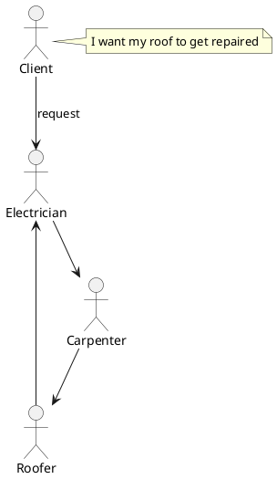

```plantuml

@startuml

:Carpenter: as carp

:Roofer: as roof

:Electrician: as elec

:Client: as client

elec --> carp
carp --> roof
roof --> elec
client --> elec : request

note right of client : I want my roof to get repaired


@enduml
```
