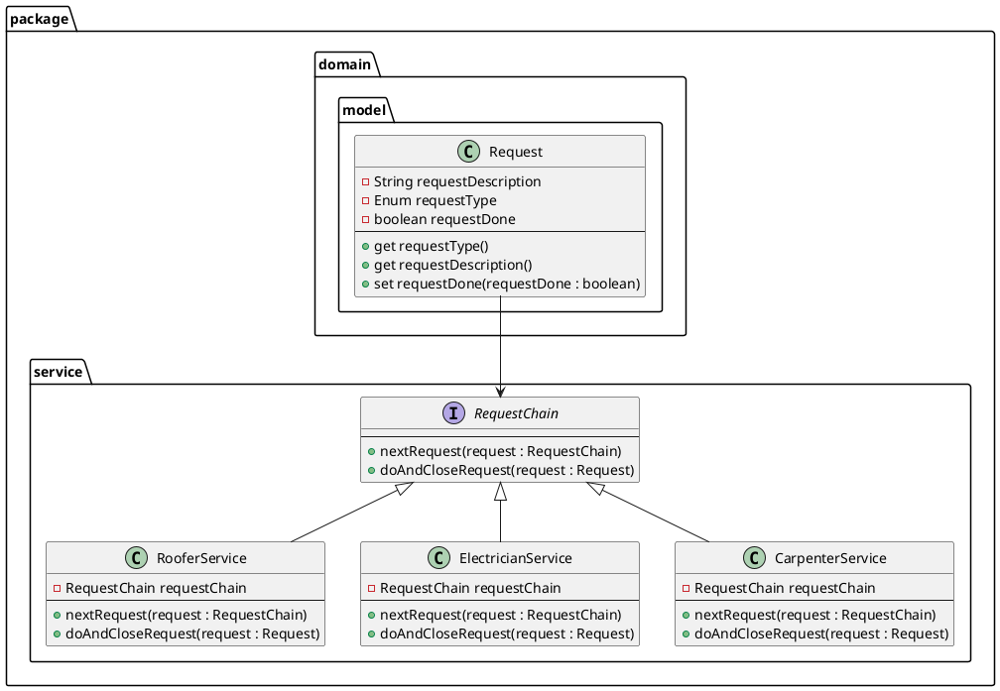

```plantuml

@startuml


namespace package.service{
    interface "RequestChain" as chain{
        --
        +nextRequest(request : RequestChain)
        +doAndCloseRequest(request : Request)
    }

    class "RooferService" as a{
        -RequestChain requestChain
        --
        +nextRequest(request : RequestChain)
        +doAndCloseRequest(request : Request)
    }

    class "ElectricianService" as b{
        -RequestChain requestChain
        --
        +nextRequest(request : RequestChain)
        +doAndCloseRequest(request : Request)
    }

    class "CarpenterService" as c{
        -RequestChain requestChain
        --
        +nextRequest(request : RequestChain)
        +doAndCloseRequest(request : Request)
    }
}

namespace package.domain.model{
    class "Request" as client{
        -String requestDescription
        -Enum requestType
        -boolean requestDone
        --
        +get requestType()
        +get requestDescription()
        +set requestDone(requestDone : boolean)
    }
}

package.service.a -u-|> package.service.chain
package.service.b -u-|> package.service.chain
package.service.c -u-|> package.service.chain

package.domain.model.client --> package.service.chain


@enduml
```
