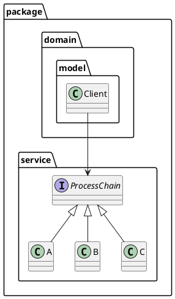

```plantuml

@startuml


namespace package.service{
    interface "ProcessChain" as chain{}

    class "A" as a{}

    class "B" as b{}

    class "C" as c{}
}

namespace package.domain.model{
    class "Client" as client{}
}

package.service.a -u-|> package.service.chain
package.service.b -u-|> package.service.chain
package.service.c -u-|> package.service.chain

package.domain.model.client --> package.service.chain


@enduml
```
