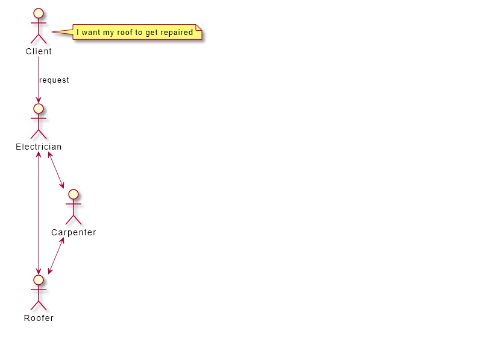

# Chain of Responsibility Pattern

## Real life scenario

A Client requests an electrician to repair his roof. The electrician takes the request but he doe not know how to build a roof. So the electrician sends the request to the roofer. (We can already see the disadvantage. If he sends it to the carpenter he has to send it so the roofer)

## Java inplementation example

